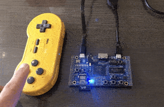

# ulx3s-bluetooth-gamepad

This is a simple Bluetooth demo that allows various Bluetooth gamepads to be connected to an ESP32, which in turn forwards the gamepad state to an FPGA using SPI. The gamepad state is shown on LEDs and can be paged using a button on the PCB itself. This demo runs on the [ULX3S](https://github.com/emard/ulx3s) boards.

The ESP32 software is from a [fork](https://github.com/dan-rodrigues/unijoysticle2/tree/snes-spi) of the [unijoysticle2](https://github.com/ricardoquesada/unijoysticle2) project. Changes were made to accomodate a SNES-style gamepad and to convert the ESP32 into an SPI master to send gamepad state to the FPGA. A status LED and ESP32 reset button was also added.

This demo was tested on 8BitDo SN30 and Zero-2 gamepads but others are thought to work too.

This basic project can be used as a starting point for other projects that can benefit from Bluetooth gamepads. The core functionality for the FPGA is in [esp32_spi_gamepad.v](esp32_spi_gamepad.v).



## Prerequisites

* [Espressif IDF](https://docs.espressif.com/projects/esp-idf/en/latest/esp32/get-started/) (IDF4 was used for this demo)
* [yosys](https://github.com/YosysHQ/yosys)
* [nextpnr-ecp5](https://github.com/YosysHQ/nextpnr)
* [fujprog](https://github.com/kost/fujprog)

## Usage

### Building

First clone the required submodules.

```
git submodule update --init --recursive
```

The [flash_all.sh](flash_all.sh) convenience script can then be used to build and flash both the ESP32 software and the FPGA bitstream. Variables in the script need to be set before running it. The ESP32 passthru is preloaded before attempting to flash it and button 0 might need to be held when it starts printing `Connecting...` to the console.

It's assumed that the IDF `export.sh` script has been sourced in the shell before running this, so `$IDF_PATH` and the IDF python venv should have been activated first, or else there will be errors when attempting `idf.py flash`.

Flashing the ESP32 software will clobber any MicroPython installation or any other binaries at the default flash location so backups should be made first if needed.

### Controls

PCB button controls:

* 0: ESP32 reset. If the gamepad isn't connecting, resetting the ESP32 usually fixes it.
* 1: Toggle LED page. There are 12 inputs but only 8 LEDs, so this button toggles which are visible.

### LEDs

The main gamepad LEDs (D0-D7) show last received gamepad state from the controller.

The status LED (D22, blue on bottom left) shows the current ESP32 status:

* On powerup, it should turn on for about a second and then remain flashing until a controller is connected.
* When a controller is connected, it will stop flashing and remain on. The gamepad LEDs should then update according to the gamepad inputs.
* If the status LED stays flashing while attempting to connect a controller, trying resetting it by pressing button 0.

